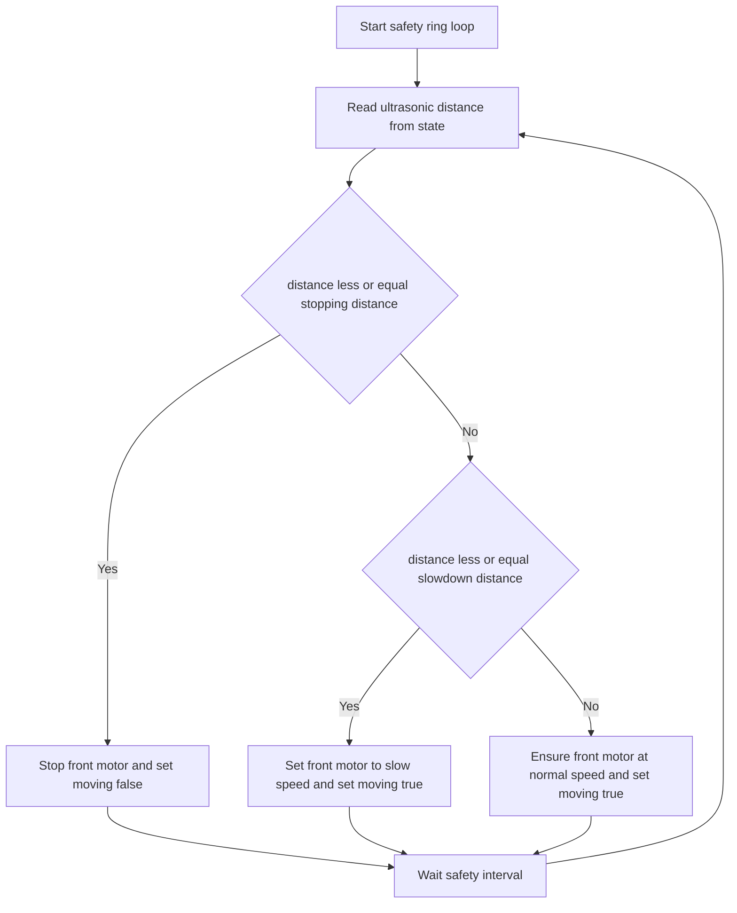
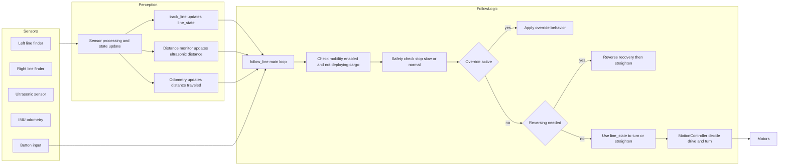
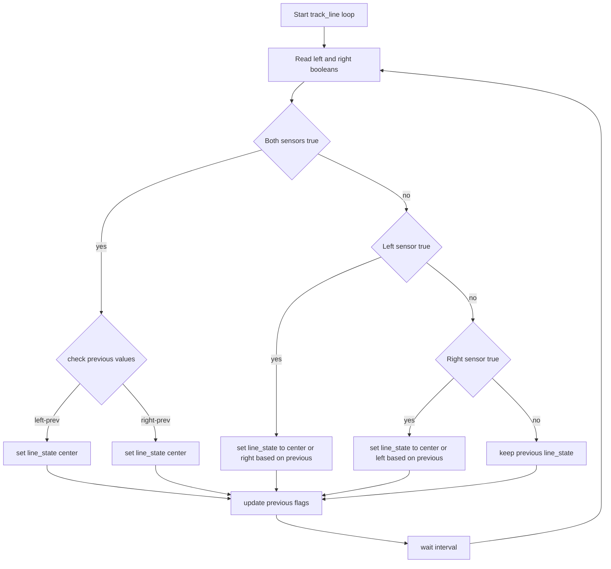

# Mobility System API

> Motor control with line following, safety features, and encoder tracking

```python
from systems.mobility_system import MotionController
```

---

## MotionController

Motor control system with line following, ultrasonic safety ring, and encoder tracking.

### Constructor

```python
controller = MotionController(
    front_motor="A",
    turn_motor="B",
    state=state,
    slowdown_distance=30.0,
    stopping_distance=15.0,
    forward_speed=20,
    forward_speed_slow=10,
    turn_speed=20,
    max_turn=100,
    wheel_ratio=9.0,
    turn_amount=20,
    line_follow_interval=0.1,
    override_mode="straight",
    override_distance=6.0,
    reverse_enabled=True,
    reverse_speed=10,
    stuck_threshold=10,
    reverse_intervals=5,
    turn_mode="fixed"
)
```

| Parameter | Type | Default | Description |
|-----------|------|---------|-------------|
| `front_motor` | str | `"A"` | Build HAT port for front motor |
| `turn_motor` | str | `"B"` | Build HAT port for turn motor |
| `state` | State | required | Centralized state object |
| `slowdown_distance` | float | `30.0` | Distance to start slowing (cm) |
| `stopping_distance` | float | `15.0` | Distance to stop (cm) |
| `forward_speed` | int | `20` | Normal forward speed |
| `forward_speed_slow` | int | `10` | Reduced speed in slowdown zone |
| `turn_speed` | int | `20` | Turn motor speed |
| `max_turn` | int | `100` | Maximum turn angle from center |
| `wheel_ratio` | float | `9.0` | Ratio between wheel motor degrees and turn motor degrees |
| `turn_amount` | int | `20` | Degrees to turn when correcting line position |
| `line_follow_interval` | float | `0.1` | Seconds between line following updates |
| `override_mode` | str | `straight` | Override behavior: `straight`, `left`, or `right` |
| `override_distance` | float | `6.0` | Distance in cm to travel while in override mode |
| `reverse_enabled` | bool | `True` | Enable reverse recovery when stuck |
| `reverse_speed` | int | `10` | Reverse speed (positive value, used as negative for reversing) |
| `stuck_threshold` | int | `10` | Number of intervals in same line state before triggering reverse |
| `reverse_intervals` | int | `5` | Number of intervals to reverse for recovery |
| `turn_mode` | str | `fixed` | `fixed` or `dynamic` turn behavior during corrections |

### Attributes

| Attribute | Type | Description |
|-----------|------|-------------|
| `front_motor` | Motor | Front drive motor instance |
| `turn_motor` | Motor | Steering motor instance |
| `state` | State | Shared state object |
| `central_pos` | float | Center position for steering |
| `moving` | bool | Whether robot is currently moving |
| `current_speed` | int | Current speed setting |
| `line_state` | str | Current line following state ("left", "center", "right") |
| `prev_left_in` | bool | Previous left line finder value |
| `prev_right_in` | bool | Previous right line finder value |
| `wheel_ratio` | float | Ratio between wheel and turn motor degrees |
| `turn_amount` | int | Degrees to turn when correcting |
| `line_follow_interval` | float | Seconds between line following updates |
| `reverse_enabled` | bool | Whether reverse recovery is enabled |
| `reverse_speed` | int | Speed used during reverse recovery |
| `stuck_intervals` | int | Internal counter of consecutive stuck intervals |
| `reversing` | bool | Whether currently in reverse recovery |

---

## Motor Control Methods

### `start(speed=None)`

Start the front motor at specified or default speed.

```python
controller.start()  # Use default forward_speed
controller.start(speed=15)  # Custom speed
```

### `stop()`

Stop all motors immediately.

```python
controller.stop()
```

### `async reverse()`

Start front motor in reverse.

```python
await controller.reverse()
```

---

## Turning Methods

### `async turn_left(amount=20)`

Turn left by a specified amount if within limits.

```python
await controller.turn_left(20)  # Turn 20° left
```

| Parameter | Type | Default | Description |
|-----------|------|---------|-------------|
| `amount` | int | `20` | Degrees to turn |

### `async turn_right(amount=20)`

Turn right by a specified amount if within limits.

```python
await controller.turn_right(20)  # Turn 20° right
```

### `async turn_left_start()`

Start turning left continuously.

```python
await controller.turn_left_start()
```

### `async turn_right_start()`

Start turning right continuously.

```python
await controller.turn_right_start()
```

### `async stop_turn()`

Stop the turn motor.

```python
await controller.stop_turn()
```

### `async straighten()`

Straighten wheels back to central position.

```python
await controller.straighten()
```

### `async recalibrate_center()`

Set current turn position as the new center.

```python
await controller.recalibrate_center()
```

---

## Safety Methods

### `get_distance()`

Get distance from ultrasonic sensor via State.

```python
distance = controller.get_distance()
```

**Returns:** `float` - Distance in cm from `state.ultrasonic_distance`

### `async start_safety_ring()`

Start the ultrasonic safety monitoring loop.

```python
await controller.start_safety_ring()
```

**Behavior:**
- Continuously monitors ultrasonic distance
- `distance > slowdown_distance`: Normal speed
- `stopping_distance < distance ≤ slowdown_distance`: Slow speed
- `distance ≤ stopping_distance`: Stop

#### Safety Ring - Diagram


### `async run_with_safety()`

Start motor and safety ring together.

```python
await controller.run_with_safety()
```

### `trigger_override(distance=None)`

Trigger override mode which straightens the wheels and travels a specified distance before resuming line following.

```python
controller.trigger_override(distance=10.0)
```

**Behavior:**
- Sets `state.override` to True and records `override_start_distance` and `override_end_distance` in `State`.
- Uses `distance` argument or the controller's default `override_distance` if None.

---

## Line Following


### `async follow_line()`

Main async routine for line following. Starts `track_line` for independent line state tracking.

```python
await controller.follow_line()
```

**Features:**
- Combines safety monitoring with line following
- Starts `track_line` async loop for line state tracking
- Reads line finder values from State
- Pauses when `state.deploying_cargo` is True
- Pauses when `state.mobility_enabled` is False (button toggle)
- Uses state machine for smooth tracking
- Supports override and reverse recovery modes (configurable)

**Line State Machine:**

| State   | Meaning                      | Action      |
|---------|------------------------------|-------------|
| left    | Robot is to the left of line | Turn right  |
| center  | Robot is centered on line    | Straighten  |
| right   | Robot is to the right of line| Turn left   |

**Transition Logic:**

When a sensor triggers from both clear:
- If previous state was opposite side → transition to `center`
- Otherwise → transition to opposite side

**Reverse Recovery:**
- If stuck in left/right state for too long, triggers reverse recovery (configurable via `reverse_enabled`, `reverse_speed`, `stuck_threshold`, `reverse_intervals`).

**Override Mode:**
- Temporarily disables line following and applies override behavior (straight/left/right) for a set distance.

**Line Tracking:**
- `track_line` runs as an independent async loop, updating `State.line_state` from line sensors using instance variables (`self.left_in`, `self.right_in`).

### Mobility System - Diagram


### Line Tracker (track_line) - Diagram


### follow_line (main loop) - Diagram
```mermaid
flowchart TD
    FStart[Start follow_line] --> StartForward[Start front motor at forward speed]
    StartForward --> StartTrack[Start track_line task]
    StartTrack --> Loop{Main loop}
    Loop --> CheckMob{Mobility enabled and not deploying cargo}
    CheckMob -- No --> StopAndWait[Stop front motor and wait] --> Loop
    CheckMob -- Yes --> SafetyCheck[Read ultrasonic distance]
    SafetyCheck --> StopCheck{distance less or equal stopping distance}
    StopCheck -- Yes --> StopPause[Stop front motor set moving false] --> Loop
    StopCheck -- No --> SlowCheck{distance less or equal slowdown distance}
    SlowCheck -- Yes --> SlowStart[Start front motor slow set moving true] --> AfterSpeed
    SlowCheck -- No --> NormalStart[Start front motor normal set moving true] --> AfterSpeed
    AfterSpeed --> OverrideCheck{state.override active}
    OverrideCheck -- Yes --> OverrideDistance{distance traveled >= override end}
    OverrideDistance -- No --> ApplyOverride[Apply override (straight/left/right) and wait interval] --> Loop
    OverrideDistance -- Yes --> EndOverride[Straighten and clear override] --> Loop
    OverrideCheck -- No --> MovingCheck{moving true}
    MovingCheck -- No --> Loop
    MovingCheck -- Yes --> ReversingCheck{reversing active}
    ReversingCheck -- Yes --> DoReverse[Perform reverse recovery then straighten] --> Loop
    ReversingCheck -- No --> LineDecision[Use state.line_state to turn left right or straighten]
    LineDecision --> ExecuteTurn[Call turn or straighten functions and wait interval] --> Loop
```

---

## Encoder Tracking

### `async update_motor_state()`

Update motor encoder state in State.

```python
await controller.update_motor_state()
```

**Updates:**
- `state.motor_position` - Front motor position (°)
- `state.motor_velocity` - Front motor velocity (°/s)
- `state.turn_position` - Turn motor position (°)

### `async run_update_loop(update_interval=0.1)`

Continuously update motor state at specified intervals.

```python
await controller.run_update_loop(update_interval=0.05)
```

---

## Usage Examples

### Basic Motor Control

```python
from systems.mobility_system import MotionController
from systems.state import State

state = State()
controller = MotionController(
    front_motor="A",
    turn_motor="B",
    state=state
)

# Start forward
controller.start()

# Turn left
await controller.turn_left(45)

# Stop
controller.stop()
```

### With Line Following

```python
import asyncio
from systems.state import State
from systems.sensors import SensorInput
from systems.mobility_system import MotionController

state = State()
sensors = SensorInput(state=state, line_finders=True)
controller = MotionController(state=state)

async def main():
    # Start sensor updates
    sensor_task = asyncio.create_task(sensors.run_sensor_update())
    
    # Run line following with safety
    await controller.follow_line()

asyncio.run(main())
```

### With Controller

```python
from controller import Controller

async def main():
    controller = Controller()
    await controller.initialize()
    
    # follow_line() starts automatically in run()
    await controller.run()
```

---

## State Integration

The MotionController reads from and writes to State:

**Reads:**
- `state.ultrasonic_distance` - For safety ring
- `state.lf_left_value` - Left line finder
- `state.lf_right_value` - Right line finder
- `state.deploying_cargo` - Pauses motion when True

**Writes:**
- `state.motor_position` - Front motor encoder position
- `state.motor_velocity` - Front motor velocity
- `state.turn_position` - Turn motor position

---

## See Also

- [State API](state.md) - State dataclass
- [Cargo API](cargo.md) - How `deploying_cargo` works
- [Controller API](controller.md) - How mobility is initialized
- [Architecture](../architecture.md) - System overview
